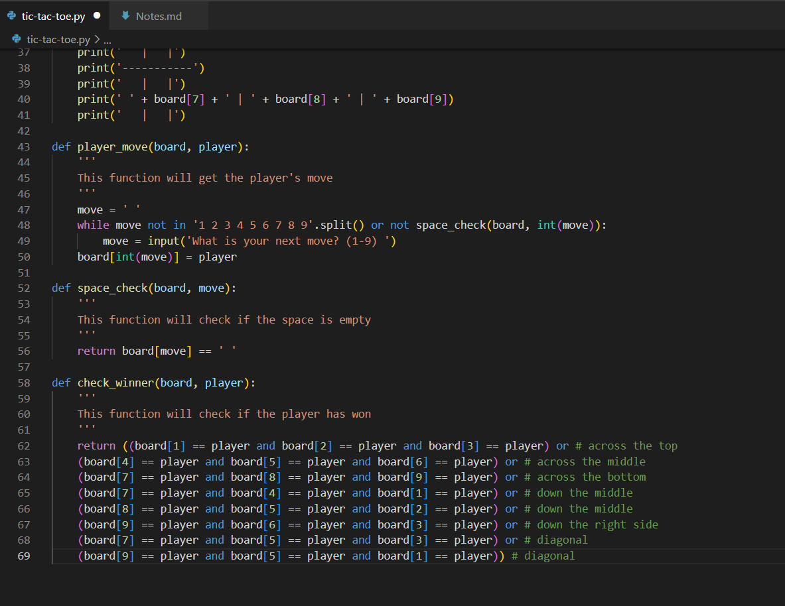
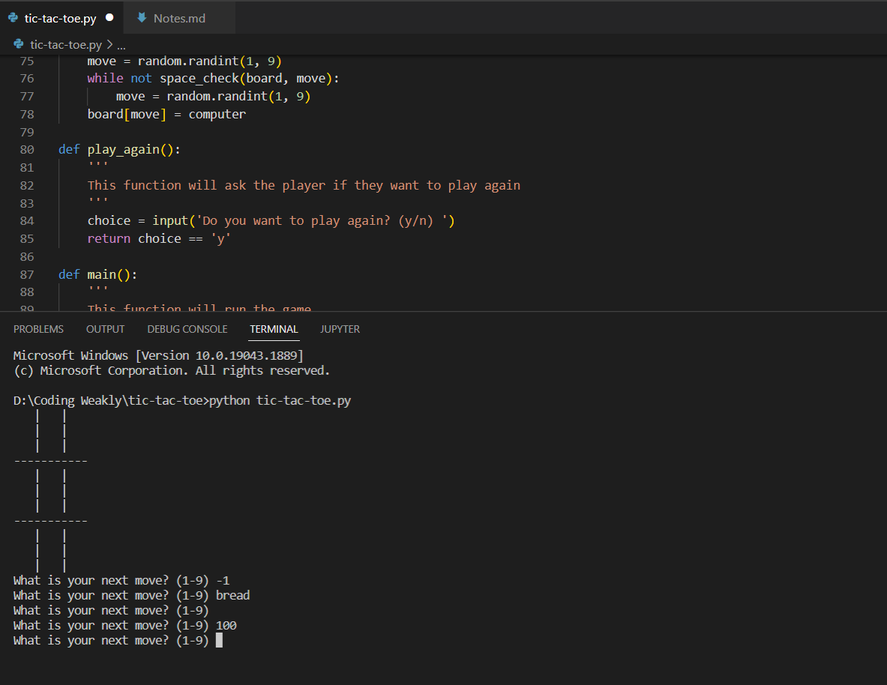

## Building a TicTacToe game in Python using GitHub Copilot

One of the projects most commonly found in a beginner developer's portfolio is TicTacToe. My goal is to evaluate how useful GitHub Copilot is when trying to complete this project.

### Initial code

When adding a docstring for the script, Copilot knew that we were building a tic tac toe game. Good start.

On the next line, it was suggested that we should import random, an indication that this might be something we will use. 

However, following all import suggestions blindly got less and less useful. So I will stick with random and add any others as neccessary.

### First Functions

Simply typing the name of our first function gives us code for some sort of solution to the task. We can see that the main tictactoe function which we are given calls other functions so we would hope Copilot might provide these or elese we are on our own.

Opening the Copilot interface at this point gives us a number of alternative solutions for the function. We could find one which suits us best but I will stick with the first suggestion.

Thankfully Copilot didn't abandon us or start using code from a completely different solution. It provided us with the next function we were looking for.

### Finishing and Running the Code

The rest of the functions we need were suggested in a similar way. These functions include a digital board and logic for a winning combination on the board. This is not to say that Copilot understands a game of TicTacToe, but it understands that these functions get used when writing the game in Python.

This appears to be all we need so I'll give it a spin. So far so good.

It seems to be handling invalid inputs well.

But, valid inputs not so well...

So using Copilot for pretty much the entirety of the code has produced something which is runnable, and which looks close to a correct solution. But there is clearly some strange bug involving the players names and the boolean value False. Before the blame gets put on Python for being dynamically typed, I'll look through what we have to see what the issue.

### Debugging

It turns out there is a pretty substantial flaw in the logic of the game where - the game continues while winner is None, but winner is then assigned by a function which returns either True or False. And then winner is also used as the name of who has won. I feel like a quick play around with this section could give us a working solution, but I am not one to correct the errors of a robot. 

So the task of creating a TicTacToe game evolved into the task of debugging a solution given to us by an artificial agent. At this point we could go back to the initial tictactoe function an select another suggestion and go from there, and perhaps we would find a better solution.

### Conclusion

The main point of the TicTacToe task is to start to think like a developer and learn about the language. Using the tool in this way is equivalent to copying and pasting a solution from the internet. It might save Uni students some time and effort, but little is learnt working this way. That being said, even experienced developers need to copy and paste code now and then and the tool can certainly save some time.

Even though Copilot did not give us a complete working solution, it did provide a lot of useful functionality such as displaying the board and checking for a winner. And I feel this represents how it should be used - for more complex projects it will not even come close to providing full solutions, but it may be able to provide code snippets for common functions which exist within more complex projects.
